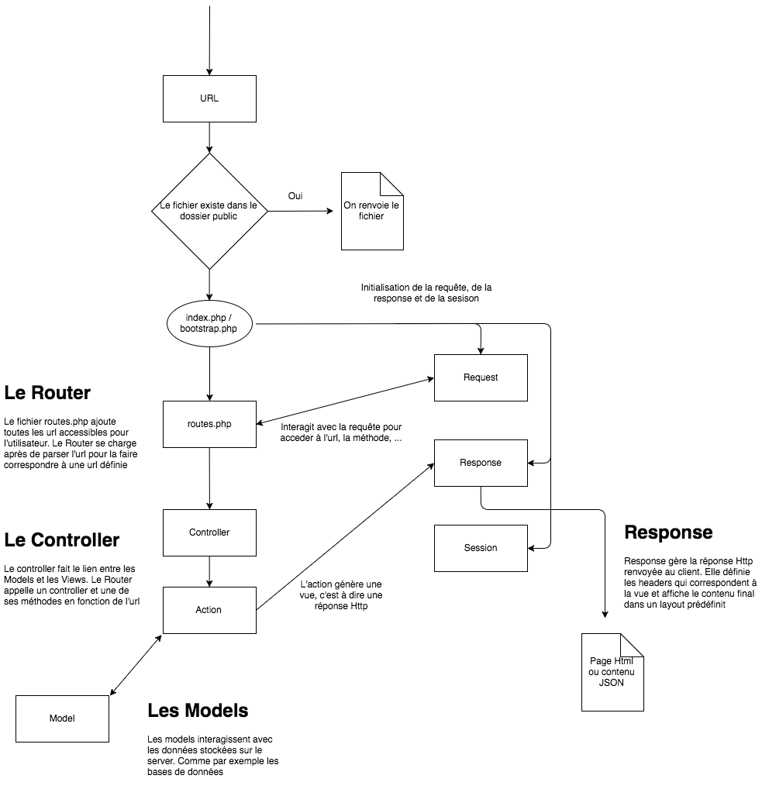
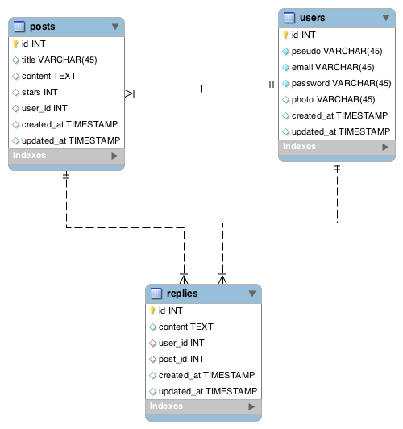

# Projet d'IO2
Maxime Flin & Louis Gavalda

## Que fait notre site ?
Nous avons souhaité créer un forum de discussion destiné aux étudiants de l'université Paris Diderot. C'est la première idée qui nous est venue, puisqu'une telle application comporte quasi-systématiquement les fonctionnalités qui étaient imposées (création de compte, page de profil, recherche dans le contenu, etc.). Le site a été conçu pour être simple/efficace à utiliser.

Nous nous sommes fixé deux contraintes à respecter :
* obtenir du code qui serait partiellement réutilisable au sein de futurs projets (donc clair, _propre_ et modulaire) ;
* rendre accessible ledit forum en le mettant en ligne afin qu’il soit bel et bien utilisable par les étudiants.

Depuis plusieurs semaines, le forum est ainsi accessible à l'adresse suivante : [http://diderot.club/](http://diderot.club/)


## Qu’avons-nous appris durant ce projet ?
Nous nous sommes aperçus que, même lorsqu'une application est apparemment finalisée, la mise en production peut, elle aussi, réclamer énormément de temps : les surprises sont nombreuses (erreurs soudaines ; comportements inattendus; etc.) et il faut souvent faire faces à divers imprévus inhérents au monde de l'informatique (pannes, sauvegardes, etc.). La documentation des autres grands projets open source (PHP, notamment) est heureusement largement fournie, ce qui nous a permis de résoudre tous les problèmes rencontrés.

Durant sa mise en place, le serveur nous a en effet donné un sacré fil à retordre : l'installation et la configuration des différentes composantes d'un serveur web — Nginx, PHP et MariaDB/MySQL, dans notre cas —  doivent être faites en tenant compte de la compatibilité (ou incompatibilité !…) selon les versions. Nous employons par exemple certaines fonctionnalités de PHP qui ne sont présentes qu’à partir de la version 5 (et PHP doit être associé à des librairies précises faisant l'interface entre les différentes composantes, etc.).

Mais travailler en commun sur ce projet a évidemment constitué une très belle expérience. Chacun possédait déjà certaines connaissances en développement web avant cette première année de licence, aussi nous avons pu immédiatement travailler de manière efficace. En mettant en place le serveur, nous nous sommes retrouvés immergés dans un environnement UNIX qu'il a fallu configurer en ligne de commande, ce qui a constitué un rappel bienvenue. Tout ceci nous a donné un aperçu de ce que peut être un travail en informatique.


## Notre code : une architecture façon framework
Puisqu'il n'était pas permis de s'appuyer sur des frameworks existants, nous avons d'abord créé une base robuste (modérément inspirée du framework Laravel) autour de laquelle est ensuite venue se construire notre application.

Notre code s'organise selon une architecture de type _Model-View-Controller_ (ou MVC) :
- /app Ensemble des fichiers de l'application
    - /controllers Contrôleurs
    - /model Modèles
    - /helpers Helpers (utlisés dans les vues)
    - /exception Gestion des erreurs
    - /views Vues
        - /layout Layouts de base depuis lesquels sont construits tous les autres
    - config.php Fichier de configuration principal
    - routes.php Fichier faisant le lien entre les URL et les contrôleurs
- /lib Classes de l'application
- /public Ressources client (face utilisateur de l'application)
- /tmp Fichiers temporaires utilisés lors du débuggage (fichiers de log, etc.)


### Avant toute chose
Pour déployer notre application, il faut au préalable former les bases de données. La commande à exécuter depuis le répertoire racine de l'application est la suivante :

```
    php serve init
```

Ceci affichera le fichier SQL à exécuter. Il faut aussi changer les variables utilisées pour l'accès à la base de données en éditant le fichier `app/config.php`.

Pour lancer un serveur local qui fera tourner l'application, il faut entrer la commande suivante (toujours depuis le dossier racine de l'application) :

```
    php serve
```

### I.) La redirection d'URL
Les URL des pages du forum intuitives : plutôt que d'accéder à une page grâce à l'URL `/posts/singlepost.php?id=12` (un chemin vers un fichier PHP), il a été fait en sorte que l'URL soit simplement `/posts/1`.
Pour ce faire, on redirige toutes les requêtes HTTP de la façon qui suit :
* Quelle que soit l'URL, on redirige dans le dossier `public/` (face utilisateur de l'application) ;
* Dans ce dossier `public/`, si l'URL mène vers un fichier, alors on redirige vers ce ficher, sinon on redirige vers le ficher `index.php` (_mauvaise_ URL).

Il existe plusieurs manières d'effectuer de telles redirections d'URL. Sur notre serveur, c'est Nginx qui s'en charge directement (il s'agit alors de bien dresser Nginx grâce aux fichiers de configuration). En local, nous avons tous les deux utilisé les fichiers `.htaccess` propres au serveur Apache. Nous avons également créé un petit script PHP, `serve`, qui démarre l'application sur un serveur PHP local (ce script est d'ailleurs inspiré par les fichiers de configuration de Nginx).

Les ressources sont ainsi chargées avec des URL très intuitive (pour l'utilisateur, mais aussi au sein de nos propres scripts). Les deux avantages principaux sont :
* On sépare clairement la face visible par l'utilisateur (le front-end) de tout ce qu'il peut se passer d'autre dans le fonctionnement de l'application (le back end). Ici, le front-end est constitué exclusivement des fichiers et répertoires présents dans `public/`.
* On peut gérer les exceptions — comme par exemple les posts non trouvés — directement au sein du code, et ceci offre beaucoup plus de liberté et de modularité.

Toutes les URL emmènent maintenant sur le même ficher : `index.php`. Il faut donc lire les URL demandées par l'utilisateur afin de charger le contrôleur qui correspond. Pour ce faire, le fichier `index.php` inclut le fichier `/lib/bootstrap.php` qui, lui-même, va progressivement inclure les différentes composantes de l'application, dont notamment trois classes essentielles pour notre architecture MVC: `Request`, `Router` et `Response`. Les instances de ces classes décrivent, respectivement, ce que reçoit le serveur, la manière dont il traite la requête, et la réponse qu'il fournit au client.

Le diagramme suivant illustre la structure globale de notre application :




### II.) L'application web
Tous les fichiers d'après lesquels sont dynamiquement construites les pages se situent dans le dossier `app/`. Les autres dossiers constituent une base modulaire dont nous nous resservirons au sein projets futurs. L'ajout d'une nouvelle page au site requiert plusieurs actions :
* Ajouter la nouvelle URL au fichier `routes.php` ;
* Créer le contrôleur et la fonction correspondante ;
* Charger et « rendre » une vue dans ce contrôleur ;
* Créer enfin la vue correspondante.
S'ajoute à cela un éventuelle création de modèles (par exemple pour interagir avec la base de donnée, ou pour gérer des erreurs en créant des exceptions).

Nous allons maintenant détailler ces étapes du développement.

#### A) Les routes
Le fichier `routes.php`, situé à la base du dossier `app/`, contient toutes les URL auxquelles l'application associera un contrôleur et une action (c'est-à-dire une méthode de ce contrôleur). On décrit une URL de la façon suivante :

```php
    App::$route->get(url, action) // pour une requête de type GET
    App::$route->post(url, action) // pour une requête de type POST
    App::$route->put(url, action) // pour une requête de type PUT
```

Dans les lignes précédentes `url` est l'URL demandée lors de la requête. On peux y ajouter des paramètres afin que cette URL décrive un ensemble d'URL. Par exemple, on peut vouloir que les pages `/posts/1` et `/posts/254` appellent toutes les deux la même méthode du conrôleur mais avec des variables différentes (qui correspondraient ici à l'identifiant du post). On écrit alors ce paramètre `{nom_du_paramètre}` dans l'URL.

Il faut toutefois spécifier le type du paramètre au moyen d'une expression régulière (ou regex). Pour ce faire, on utilise la fonction `App::$route->setPattern(nom, regex)`. La route cherchera alors le paramètre d'URL correspondant à l'expression régulière donnée. Dans le cas des posts décrits ci-dessus, il faudrait ajouter le code suivant au ficher `app/routes.php` :

```php
    App::$route->setPattern('id', '[0-9]+');
    App::$route->get('/posts/{id}', 'Controller@methode');
```

La route nous fournit ainsi la possibilité d'appliquer des filtres aux URL. Par exemple, puisque la page de création d'une conversation est réservée aux utilisateurs connectés, il nous suffit d'ajouter un filtre `authenticate` à l'URL :

```php
    App::$route->filter(['authenticate'], function () {
        App::$route->get('/posts/new', 'Controller@method');
    });
```

Ainsi la fonction passée en paramètre ne s'exécute que si **tous** les filtres du tableau sont vérifiés (renvoient `true`). On peut aussi bien sûr prendre la négation d'un filtre et ajouter un ensemble d'URL dans le cas où **au moins un** des filtres n'est pas validé.

```php
    App::$route->filter(['filtre1', '!négation', function () {
        // si tous les filtres sont validés   
    }, function () {
        // si au moins un filtre n'est pas validé   
    });
```

### B) Les contrôleurs
Nous avons vu, dans la section précédente, comment l'application redirige dynamiquement les URL sur des méthodes spécifiques des contrôleurs. Nous allons maintenant voir comment les contrôleurs nous permettent, très simplement, de fournir une réponse élaborée en fonction de la requête.

Un contrôleur est une classe qui hérite de `BaseController` et qui se trouve dans le dossier `app/controllers/BaseController.php`. Le fichier dans lequel se trouve le contrôleur doit être `app/controller/Nom.php` (où Nom est le nom du contrôleur. Le code minimum au sein du fichier d'un contrôleur est donc :

```php
    class PostsController extends BaseController {

    }
```

Le contrôleur a plusieurs attributs qui peuvent être modifiés suivant des besoins :
* Le layout : `$this->layout` est le nom de la vue globale dans laquelle est injectée le contenu des vues chargées dans les contrôleurs ;
* Les modèles : `$this->model` est le tableau de tous les modèles à charger dans les contrôleurs ;
* Les helpers : `$this->autoLoadHelpers` est le tableau de tous les helpers chargées dans les vues.

Ces attributs, modifiables à tout moment, sont spécifiques à chaque contrôleur et valent par défaut, respectivement, "basics", \["NomDuControllerAuSingulier"\] et \["Html"\].

Admettons, pour l'exemple, que la route appelle l'action `PostsController@index`. La méthode `index` de la classe `PostsController` est alors appellée. La syntaxe pour cette méthode est la suivante :

```php
    class PostsController extends BaseController {

        public function index ($param_url1, $param_url2) {
            // Actions: requêtes SQL, traitement de données, etc.
        }

    }
```

Les paramètres d'URL définis dans la route apparaissent donc dans les paramètres de la méthode appellée.

Il convient alors de renvoyer une vue. Pour ce faire, on appelle l'objet `Response` (dont l'instance se trouve dans la class `App`). Pour renvoyer une vue, c'est la fonction `requireView` qui est employée. Cette fonction va stocker au sein d'une variable le contenu de ce qui doit être affiché la vue, puis retourner cette variable. Elle prend plusieurs paramètres :
* le chemin depuis `app/view/` (le point est utilisé comme séparateur pour les dossiers) ;
* un tableau associatif des variables à injecter dans la vue ;
* les helpers pouvant être requis par la vue.

Si cette vue est le rendu définitif de la page (celle déliverée à l'utilisateur), on peut utiliser la fonction `view` de l'objet Response (qui va donc injecter cette vue dans le layout).

Le code est donc :

```php
    class PostsController extends BaseController {

        public function index () {
            // sélection, via un modèle, des post dans la variable $posts
            App::$response->view('posts.index', ['posts'=>$posts]);
        }

    }
```

### C) Les modèles
Les modèles nous servent à sélectionner les éléments au sein la base de données. Ces modèles se trouvent dans le dossier `app/models/`. Tous ces modèles héritent de la classe `Model` qui gère la plupart des situations rencontrées par l'application. Les modèles définis lors du développement du site sont donc réduits à un ensemble de variables définissant la structure de la base de données.

Les variables à définir sont donc:
* `$table` le nom de la table associée au modèle :
* `$belongsTo` un tableau de toutes la relations du type « appartient à ». Par exemple, un post appartient à un utilisateur :  ce champs permettra une sélection automatique de l'utilisateur autour d'un post ;
* `$hash` les variables à stocker dans la base de données sous forme d'empreintes ;
* `$attributes` le type du champ de la base de données (c'est-à-dire le type de formulaire associé au champ) ;
* `$validation` le tableau contenant les filtres auxquels les données doivent se conformer pour être ajoutées à la base de données.

Ainsi, le modèle `app/models/Post.php` contient par exemple :

```php
    class Post extends Model {

        protected $table = 'posts';

        public $attributes = [
            'title' => 'text',
            'content' => 'textarea'
        ];

        public $validation = [
            'title' => ['required', 'max:50'],
            'content' => ['required, 'min:10']
        ]
    }
```

Une fois le modèle créé, il pourra être utilisée au sein d'un contrôleur. Pour ce faire, on appelle l'instance du modèle à charger dans le contrôleur et on utilise les méthodes ci-dessous.

#### Sélectionner des données
On utilise la méthode get :

```php
    $posts = $this->post->get();
```

On peut adjoindre certaines conditions à cet appel, comme les champs à sélectionner, ou comme des conditions sur ces champs. Ces fonctions sont composées avant l'appel de le méthode `get`. Ainsi, on utilise la syntaxe suivante :

```php
    $posts = $this->post
                    ->select(['alias1'=>'col1', 'alias2'=>'col2'])
                    ->order('id', 'desc')
                    ->where('col3','>', '2')
                    ->get();
```

La seule contrainte est d'appeler `get` en dernier.


#### Insérer des données
```php
    $this->post->insert([
        'col1' => 'val1',
        'col2' => 'val2',
        // …
    ]);
```

#### Modifier des données
```php
    $this->post->update ([
        'col1' => 'newval1',
        'col2' => 'newval2',
        // …
    ]);
```

Pour la méthode `update`, on pourra aussi composer grâce à la fonction `where`.


#### Supprimer des données
On utilise la méthode `delete` dont l'utilisation est identique à `get`.


### D) Les filtres

Tous les filtres se trouvent au sein du fichier `app/Filters.php`. Celui-ci contient deux namespaces : `Router` et `Model`. Ces deux namespaces possèdent chacun un trait (nommé `Filters`) contenant, respectivement, tous les filtres du routeur, et tous les filtres du modèle. Pour créer un filtre, il suffit d'ajouter une fonction dans le trait correspondant. Cette fonction doit retourner `true` si les filtre est validé, et `false` sinon.

Un exemple de filtre dans un modèle :

```php
    /**
     * Vérifie que la longueur du champ n'excède pas un entier donné
     * @param  String $field Nom du champ
     * @param  String $val Valeur
     * @param  int $max Longueur maximale
     * @return Boolean
     */
    function max($field, $val, $max) {
        return strlen($val) <= $max;
    }
```

Et dans une route :

```php
    /**
     * Teste la connexion d'un utilisateur
     * @return Boolean True Si un utilisateur est connecté (session)
     */
    function authenticate () {
        return \Session::isAuthenticate();
    }
```

Les filtres peuvent donc prendre certains paramètres (après `$field` et `$val`). Dans les tableaux associatif des modèles, les paramètres sont séparées par `:`.


### E) Les helpers

Les helpers sont des classes qui permettent d'automatiser certaines actions dans les vues. Un helper peut par exemple servir à générer automatiquement, pour tout le site, un code HTML uniforme pour les liens et les formulaires. Les helpers se trouvent dans le dossier `app/helpers/` sont appellées lorsqu'une vue est chargée dans un contrôleur. Par exemple :

```php
    App::$response->view('posts.show', ['post'=>$post, 'replies'=>$replies],['Form'=>[$this->reply]]);
```

On charge ici le helper `Form` crée au préalable. Le tableau auquel il est associé contient l'ensemble des paramètres à passer au constructeur. Dans le cas de ce helper, il prend pour unique paramètre le modèle associé au formulaire que l'on souhaite créer.

Ce helper regroupe un ensemble de fonctions qui peuvent être appellées dans la vue. Par exemple :

```php
    <?= $Form->createForm($method, ['class'=>'form']) ?>
        <?= $Form->input('title', 'Titre',['id'=>['unID']]) ?>
        <?= $Form->input('content', 'Contenu') ?>
        <?= $Form->submit('Valider') ?>
    <?= $Form->endForm() ?>
```

L'utilisation d'un helper dépend donc entièrement de la façon dont il est fait.


### F) Les exceptions
La redirection d'URL mise en place fait que le serveur ne perçoit aucune erreur (hormis les erreurs internes causées par l'incompétence des développeurs). Il nous a donc fallu créer un système permettant à l'application de renvoyer des erreurs (système que l'on retrouve dans les exceptions). Pour renvoyer une erreur du type `404 - Not Found`, il faudra ainsi se servir du code suivant :

```php
    throw new NotFoundException("Page introuvable.");
```

Ceci va appeler la classe `NotFoundException`, laquelle hérite de `HttpException` (situé dans `app/exceptions`). Le constructeur de cette classe va appeler le constructeur parent, lequel va interrompre le déroulement de l'application et afficher une page d'erreur. On peut bien sûr ajouter, dans le constructeur de `NotFoundException`, d'autres actions suivant ce que l'on souhaite faire, comme par exemple employer un layout précis, ou rediriger l'utilisateur. Pour diderot.club, le code est pour l'instant assez simple :

```php
    class NotFoundException extends BaseException {

        protected $code = 404;

        public function __construct($message, Exception $previous = null) {
            App::$response->setStatusCode($this->code);
            parent::__construct($message, $this->code, $previous);
        }

    }
```

L'exception parente (`HttpException`) appelle la fonction `err{code\_de\_l\_erreur}` du contrôleur `ErrorsController` si l'application est configurée en mode `prod`, et appelle le fonction `__dev` sinon. Ceci constitue une manière simple et élégante de gérer les erreurs pouvant apparaître au sein de notre code.


## Dans le cas de diderot.club
Notre base de données contient trois ensembles de données :
* les utilisateurs ;
* les posts ;
* les réponses aux posts;

Les choix faits pour diderot.club, à partir de l'architecture de base que nous avons développée, sont détaillés ci-dessous.


### Les Routes
Les routes ont été pensées afin d'être génériques et intuitives.

Pour les utilisateurs :
* `/login` Connexion
* `/register` Inscription
* `/users` Modification du profil
* `/users/{id}` Profil de l'utilisateur ayant l'identifiant correspondant

Pour les posts :
* `/posts` Tous les posts
* `/posts/{id}` Post ayant l'identifiant correspondant
* `/posts/create` Ajouter un nouveau post
* `/posts/{id}/edit` Modifier un post
* `/posts/{id}/delete` Supprimer un post


### Les contrôleurs
Chaque ensemble a ainsi dû se voir associer un contrôleur. Par convention, nous avons donné comme nom à chacun des trois contrôleurs le pluriel du nom de l'ensemble :
* `UsersController`
* `PostsController`
* `RepliesController`

### Les Models
Nous avons donc également trois modèles. Par convention, nous avons donné comme nom à chacun des trois modèles le singulier du nom de l'ensemble :
* `User`
* `Post`
* `Reply`

Enfin, la structure de la base de donnée peut être recréée grâce au fichier `/scripts/tables.sql`.




## Améliorations possibles

Certaines choses pourraient encore être améliorées, malheureusement les journées ne font que vingt-quatre heures. Voici donc quelques fonctionnalités annexes que nous aurions aimé pouvoir implémenter :
* Un système d’envoi d’e-mails, de manière à valider les inscriptions, ou pour notifier les membres ;
* Un chat en temps réel en page d’accueil ;
* Une pagination dynamique ;
* Un système d’upload de fichiers et/ou une gallerie photos.


## Le futur de diderot.club

Nous avons conçu une base de code PHP définissant une structure modulaire qui pourra être reprise lors de futurs projets. Ceci va également nous permettre aussi de poursuivre le développement du forum durant les prochains mois (puisque l’ajout de fonctionnalités se fait assez simplement). Nous prévoyons en effet de continuer à travailler sur ce projet, et peut-être même d'inviter d’autres camarades collaborateurs à se joindre à nous.


